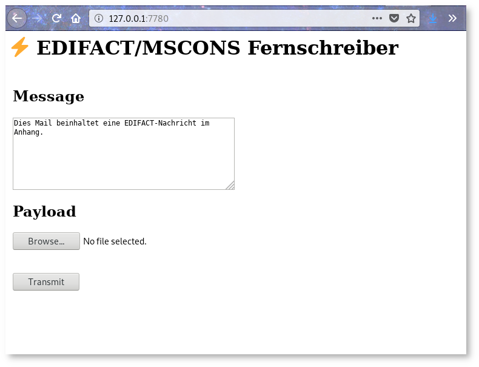

# ⚡ EDIFACT / MSCONS Fernschreiber

*a service that signs, encrypts and sends EDIFACT messages, implemented in rust*



## Configuration

* Copy Rocket.sample.toml to Rocket.toml and adjust the settings
* Create ``crypto_directory``, e.g. ``fernschreiber_codes`` with the following layout:

```
fernschreiber_codes/
  99000000000001/
    cert -> ../certs/cert1.crt
    email
    name
  99000000000002/
    cert -> ../certs/cert2.crt
    email
    name
  99000000000003/
    cert -> ../certs/cert3.crt
    email
    name
  99000000000004/
    cert -> ../certs/cert4.crt
    email
    name
  certs/
    cert1.crt
    cert2.crt
    cert3.crt
    cert4.crt
  priv/
    email
    myPrivateKey.pem
    myPublicKey.pem
    private -> myPrivateKey.pem
    public -> myPublicKey.pem
```

`99000000000001` is the UNB number of the receiver.

The format of `email` and `name` is as follows:

```
cat fernschreiber_codes/9910960000001/email
datenaustausch@buzzn-metering.de
cat fernschreiber_codes/9910960000001/name
Buzzn Metering GmbH
```

## License

Copyright 2018 Maximilian Güntner (Buzzn GmbH) < maximilian at buzzn.net >

Released under the AGPL Version 3, see LICENSE for the full text.
